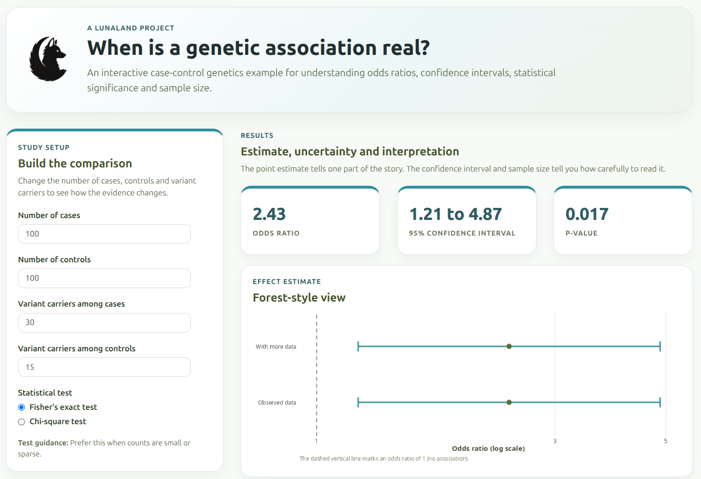
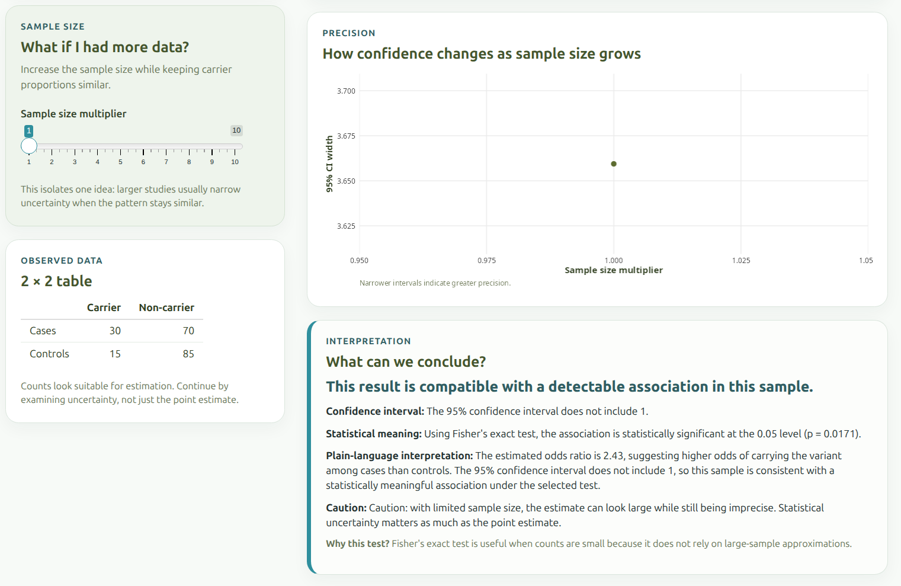

## Opening

Statistical results often look precise, but their meaning depends on how we interpret uncertainty, sample size, and effect size.

This project uses a simple case-control example to show how the same kind of result can feel convincing, fragile or misleading depending on the data behind it.

---

## The Question

When can we trust that an observed difference between groups reflects a real association?

---

## What I Built

I built an interactive Shiny app that lets users explore a simplified genetic association scenario.

The app compares variant carriers between two groups:

- cases
- controls

Users can change the number of people in each group and the number of variant carriers observed.

The app then shows how those choices affect:

- odds ratio
- confidence interval
- p-value
- interpretation

The goal is not to replace formal statistical analysis.

The goal is to make the logic of association testing easier to see.

---

## Try the App

Live app: [click here](https://paola-arguello-pascualli.shinyapps.io/genetic-association-shiny/)

### Screenshot: app overview

### Screenshot: interpretation panel

---

## What This Shows

An **odds ratio** compares how common an outcome or feature is between two groups.

A value above 1 suggests the variant is more common in cases than controls.

A value below 1 suggests the variant is less common in cases than controls.

A **confidence interval** shows the range of values that are compatible with the observed data under the model.

Wide intervals usually mean the estimate is uncertain.

Narrow intervals can look more stable, but they still depend on the assumptions behind the analysis.

A result can be statistically significant without being biologically meaningful.

A result can also be biologically interesting but too uncertain to support a strong claim.

Effect size and significance answer different questions.

---

## Where Interpretation Fails

Some interpretation failures happen when the result looks cleaner than the data really is.

**Low counts and overinterpretation** happen when a small number of observations produces a large-looking effect. The odds ratio may look dramatic, but the uncertainty can be wide.

**Misleading statistical significance** happens when a p-value is treated as the whole conclusion. A significant result still needs context, effect size, uncertainty and study design.

---

## Connection to Workflow

This statistical reasoning also applies to gene expression analysis.

In the [RNA-seq Workflow Demo](rnaseq-workflow.qmd), differential expression results are not meaningful just because a table contains small adjusted p-values.

They need interpretation.

Gene expression results depend on count structure, sample metadata, normalization, model assumptions and uncertainty.

The same principle applies here: a result is not just a number. It is evidence shaped by context.

---

## Key Concepts

- **Odds ratio** — a comparison of how common something is between two groups  
- **Confidence interval** — a range that shows uncertainty around an estimate  
- **Sample size** — the amount of data supporting the result  
- **Uncertainty** — the limits of what the data can tell us clearly  
- **Statistical significance** — a signal that the observed pattern is unlikely under a specific model  

---

## Limitations

This app is intentionally simplified.

- It uses a basic case-control scenario  
- It is not a full statistical inference pipeline  
- It does not include multiple testing correction  
- It does not account for ancestry, covariates, population structure or study design complexity  

The purpose is interpretation, not exhaustive modeling.

---

## Closing

Understanding statistical results is not just about calculation — it is about recognizing uncertainty and limits of evidence.