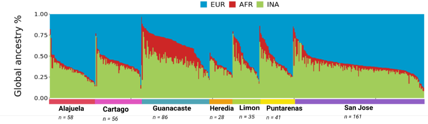
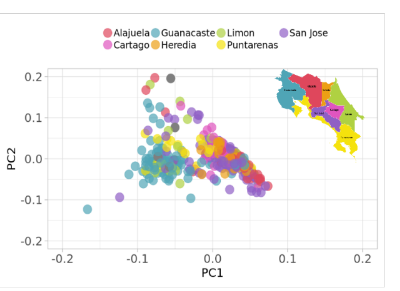

## Overview

This project was built as a compact portfolio demonstration of an idea that sits at the center of modern bioinformatics and biostatistics: **data alone are not enough**. To generate meaningful insight, we need both a reliable computational workflow to process raw data and a statistical framework to evaluate what the results actually mean.

This page brings together two connected components:

1. A lightweight RNA-seq workflow demo showing how raw sequencing reads move through quality control, processing, and quantification  
2. An interactive Shiny app showing how statistical evidence is interpreted through effect sizes, confidence intervals, and sample size

Together, they illustrate a full analytical story: **from data generation to interpretation**.

---

## 1. Problem

Genomic datasets are complex, high dimensional, and sensitive to processing choices. Before any biological or clinical conclusion can be made, raw data must first be transformed into structured, analyzable outputs through a reproducible pipeline. Even then, the work is not finished. Statistical analysis is needed to evaluate whether an observed pattern is meaningful, how uncertain it is, and how strongly it should inform a decision.

This matters because strong-looking results are not always reliable, and statistically significant results are not always important in practice. In both research and applied genomics settings, good analysis depends on two things working together:

- a transparent and reproducible data-processing workflow
- a clear statistical interpretation framework

This portfolio project was designed to show both.

---

## 2. Workflow overview

At a high level, the analytical process looks like this:

**Raw sequencing data → quality control → read processing → alignment / quantification → structured outputs → statistical analysis → interpretation**

The first half of this process focuses on computational reproducibility: making sure that data are processed consistently, with clear inputs, outputs, and assumptions.

The second half focuses on statistical reasoning: understanding effect size, uncertainty, and the practical meaning of the result.

---

## 3. RNA-seq pipeline section

### Purpose

The RNA-seq component demonstrates how raw sequencing reads can be organized into a lightweight but realistic workflow for differential expression analysis. The goal was not to build a production-scale pipeline, but to show sound workflow design, reproducibility, and clear data flow.

### Included steps

The pipeline structure includes the core stages commonly used in RNA-seq analysis:

- Quality control with FastQC
- Read trimming
- Alignment with STAR
- Counting with featureCounts
- Differential expression analysis with DESeq2

### Why this matters

In bioinformatics work, the value of a pipeline is not only in whether it runs, but in whether it is understandable, reproducible, and easy to extend. For that reason, this demo emphasizes:

- modular workflow structure
- explicit inputs and outputs
- parameterization
- environment specification
- realistic organization of files and steps

These choices make it easier to inspect how data move through the system and how results were generated.

### Reproducibility signals

The workflow is intentionally structured to highlight reproducibility practices, including:

- a Nextflow-style organization
- a central workflow file
- configurable parameters
- environment definition
- documented execution steps
- clear folder structure for inputs, outputs, and intermediate results

### Example output

### Repository

The code for the RNA-seq demo is available here:

[View the RNA-seq workflow repository](https://github.com/paola-arguello/your-rnaseq-repo)

---

## 4. Statistical analysis section

### Purpose

Once processed data have been transformed into analyzable outputs, the next challenge is interpretation. The statistical component of this portfolio focuses on a simple but important question:

**When does an observed association represent meaningful evidence?**

To explore that question, I built an interactive Shiny app around a case-control genetics scenario. The app allows users to vary the number of cases, controls, and variant carriers, and then observe how the estimated association changes.

### Core concepts

The app focuses on a small number of high-value concepts:

- odds ratios as measures of association
- confidence intervals as measures of uncertainty
- the role of sample size in shaping precision
- the difference between apparent signal and interpretable evidence

This section was designed to make statistical reasoning more visible and accessible rather than treating model output as self-explanatory.

### Why this matters

In genomics and health data analysis, interpretation often fails when numerical results are presented without context. A point estimate by itself can be misleading. A statistically significant result may still be unstable, small in magnitude, or difficult to interpret in practice. Conversely, a potentially important effect may appear inconclusive if the sample size is too limited.

This is why I wanted the statistical component of the portfolio to center not only on calculation, but on interpretation.

### App preview

### Live app / repository

[Open the Shiny app](https://your-shiny-app-link-here)  
[View the app source code](https://github.com/paola-arguello/YOUR-SHINY-REPO)

---

## 5. Interpretation section

This project is ultimately about how analytical outputs become useful evidence.

A well-structured pipeline can produce clean counts, summary tables, and differential expression results. A statistical app can calculate odds ratios and confidence intervals. But the key step is understanding **what those outputs support and what they do not**.

There are three ideas I wanted to make especially clear in this portfolio:

### Effect size matters

A result is more informative when we understand the magnitude of the observed effect, not only whether it crosses a significance threshold. In practice, the size of an effect often matters more than the binary label of “significant” or “not significant.”

### Uncertainty matters

Confidence intervals provide context that a single estimate cannot. They show how precise the estimate is and whether multiple plausible interpretations remain compatible with the data.

### Context matters

Results do not exist in isolation. Their meaning depends on study design, sample size, data quality, assumptions, and the specific question being asked. Analytical outputs should support judgment, not replace it.

In research and clinical-adjacent settings, this kind of interpretation is essential. Decisions are rarely based on one number alone. They rely on a combination of workflow quality, statistical evidence, and domain context.

---

## 6. Data and context

This portfolio project uses **public, example, or simulated data** for demonstration purposes.

The goal is not to reproduce a specific biological finding or clinical result, but to illustrate the structure of an end-to-end analytical workflow and the reasoning used to interpret outputs responsibly.

Although simplified, the components reflect the kinds of practices used in research and applied genomics settings:

- transforming raw data into structured outputs
- maintaining reproducibility and transparency
- evaluating statistical evidence with attention to uncertainty
- presenting results in a way that supports interpretation

This makes the project suitable as a compact demonstration of workflow thinking rather than as a production or diagnostic system.

---

## 7. Design decisions

This site was intentionally designed to be minimal.

### Why only one main project page?

Because the strongest version of this portfolio is not a list of disconnected tools. It is a single analytical narrative. The RNA-seq workflow and the Shiny app are presented together because they address different parts of the same problem.

### Why keep the examples lightweight?

Given the time constraint, the priority was clarity over scale. A smaller, well-explained project is more convincing than a larger project with weak framing or incomplete documentation.

### Why emphasize interpretation?

Many technical portfolios stop at computation. I wanted this one to show the next step: how outputs are evaluated, communicated, and connected back to the original question.

### Trade-offs and assumptions

This project makes several simplifying choices:

- the RNA-seq workflow is a compact demonstration rather than a production pipeline
- the statistical app focuses on one concept deeply rather than covering many methods superficially
- examples are chosen for interpretability and communication value
- public or simulated data are used to avoid privacy concerns and keep the project shareable

These trade-offs were deliberate. The goal was to build a portfolio piece that is realistic, focused, and easy to understand.

---

## What this project demonstrates

Across both components, this portfolio highlights the following strengths:

- workflow design and reproducibility
- clear input-to-output reasoning
- statistical interpretation beyond surface-level computation
- communication across technical and non-technical audiences
- practical awareness of assumptions and limitations

---

## Next steps

Potential future extensions include:

- adding a more detailed workflow diagram
- expanding the RNA-seq demo with richer summary outputs
- integrating example downstream plots from differential expression analysis
- adding a short methods appendix for technically interested readers

For now, the site is intentionally scoped to present one clear idea well: **how raw genomic data become interpretable statistical evidence**.