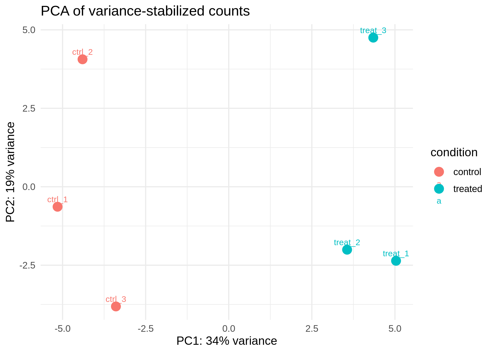
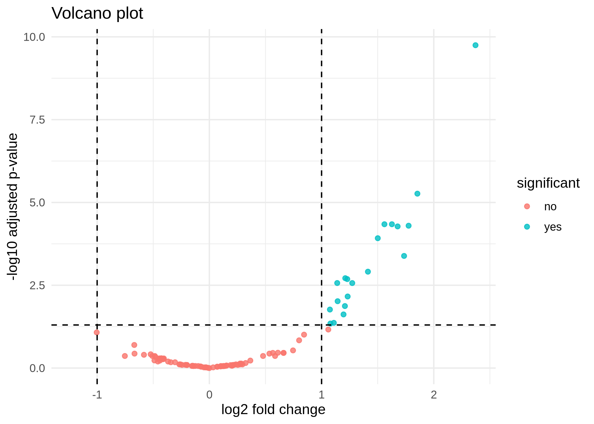

## Opening

Scientific data is messy.

Before we interpret results, data moves through multiple steps — each one making assumptions, introducing structure, and sometimes creating unintended patterns.

This project shows how RNA-seq data moves through that process, and where interpretation can become uncertain.

---

## The Question

Why does analyzing RNA-seq data require more than just running a pipeline?

---

## Workflow Overview

RNA-seq analysis is often presented as a sequence of steps:

Raw data → quality control → processing → statistical analysis → interpretation

In practice, each of these steps transforms the data.

- Quality control decides what data is considered usable  
- Alignment maps reads to a reference that may not perfectly represent the sample  
- Quantification reduces complex read data into gene-level summaries  
- Statistical analysis highlights patterns under specific assumptions  

At each step, information is filtered, reshaped, and interpreted.

The final results depend not only on the data itself, but on how these transformations are applied.

---

## What I Built

This project implements a small, modular RNA-seq workflow designed to make each step visible and reproducible.

It includes:

- Structured workflow steps (QC, alignment, quantification, analysis)  
- A differential expression analysis using gene-level counts  
- Clear input and output organization  
- Explicit configuration for reproducibility  

The goal is not to present a production-ready pipeline.

The goal is to show how analysis decisions are structured, and how they affect interpretation.

---

## Outputs

### PCA plot

A PCA plot summarizes variation across samples.

It can reveal clustering patterns, potential batch effects, or outliers.

It does not explain *why* samples cluster — only that they do.

---

### Volcano plot

A volcano plot highlights genes with large changes and strong statistical signals.

It helps prioritize candidates for further investigation.

It does not confirm biological relevance.

---

### Results table (snippet)

| Gene | log2 Fold Change | p-value | Adjusted p-value |
|------|------------------|--------|------------------|
| GeneA | 1.8 | 0.001 | 0.01 |
| GeneB | -2.1 | 0.002 | 0.02 |
| GeneC | 0.5 | 0.05 | 0.10 |

This table summarizes statistical outputs.

It shows which genes differ between conditions under a specific model.

It does not explain the biological mechanism behind those differences.

---

## Interpretation

Differential expression analysis identifies genes whose expression levels differ between conditions.

This is a statistical statement, not a biological conclusion.

A gene can appear statistically significant because:

- the effect size is large  
- the variability is low  
- the sample size is sufficient  

But statistical significance does not guarantee biological importance.

Effect size, variability, and context all matter.

Patterns in data do not automatically translate into biological insight — they require interpretation.

---

## Where Things Go Wrong

Some errors are invisible at first glance.

A [Wrong Genome Build](../pitfalls/wrong-genome-build.qmd) can shift coordinates so that reads map to the wrong locations, producing results that look valid but refer to the wrong biology.

[Batch Effects](../pitfalls/index.qmd) can introduce systematic differences between groups that are unrelated to the biological condition, creating patterns that appear meaningful but are driven by technical structure.

---

## Connecting to Statistical Reasoning

These challenges are not unique to RNA-seq.

They reflect broader questions about uncertainty, sample size, and interpretation.

See: [When is a genetic association real?](../crosswalk/posts/genetic-association-real.qmd)

Statistical results depend on how much data we have, how variable it is, and how we model it.

Understanding those limits is part of interpreting any result.

---

## Key Concepts

- **Batch effect** — differences driven by experimental conditions rather than biology  
- **Sample metadata** — information about how samples were collected and processed  
- **PCA** — a way to summarize variation across samples  
- **Differential expression** — statistical comparison of gene expression between groups  
- **Normalization** — adjusting counts to make samples comparable  

---

## Limitations

This workflow is designed as a demonstration.

- It uses public or simplified data  
- It is not a clinical-grade pipeline  
- Some steps are intentionally simplified to highlight structure rather than edge cases  

The focus is on interpretation, not optimization.

---

## Closing

Understanding data is not just about building pipelines — it is about knowing where results come from, what assumptions they carry, and how easily they can mislead.